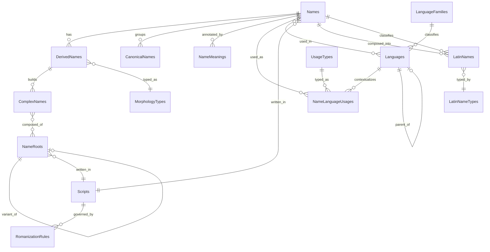

# Onomastics DB

The Onomastics Database is a modular, extensible system designed to capture the linguistic, historical, and semantic dimensions of personal names across cultures and time periods. It supports multilingual fidelity, morphological construction, and symbolic annotation—enabling researchers, linguists, and creators to trace etymologies, model derivations, and explore name usage across languages and domains.

Among its purposes is to facilitate the formulation of new historically grounded names for use in creative literary pursuits, such as worldbuilding, mythopoeia, speculative fiction, and alternate history. By combining semantic overlays, script metadata, and phonological mapping, the database empowers users to generate names that are both culturally resonant and linguistically plausible.

## Table Definitions

| Table Type               | Definition                                                                 | Purpose in Schema                                                                 | Example Tables                     |
|--------------------------|----------------------------------------------------------------------------|-----------------------------------------------------------------------------------|------------------------------------|
| **Core Entity**          | Stores foundational records that other tables reference or extend          | Anchors the schema with primary semantic units                                    | `Names`                            |
| **Reference**            | Provides reusable metadata or classification values                        | Supplies lookup values, categories, or hierarchical context                        | `Languages`, `LanguageFamilies`, `UsageTypes`, `Scripts`, `ScriptRegions`, `LatinNameTypes`, `UnicodeRanges` |
| **Composite Construction** | Represents entities built from multiple components or references         | Models derived or assembled structures from other entities                        | `ComplexNames`, `DerivedNames`     |
| **Semantic Grouping**    | Organizes entities into meaningful clusters or domains                     | Groups core entities by canonical status, semantic domain, or classification       | `CanonicalNames`                  |
| **Semantic Annotation**  | Adds descriptive or interpretive metadata to core entities                 | Enriches entities with meanings, tags, or symbolic attributes                      | `NameMeanings`                    |
| **Junction**             | Connects two or more entities in a many-to-many relationship               | Enables cross-linking between tables while preserving normalization                | `NameLanguages`, `NameLanguageUsages`, `ComplexNameRoots` |
| **Phonological**         | Models script-to-sound mappings and romanization standards                 | Supports transliteration, pronunciation, and phoneme fidelity                      | `RomanizationRules`               |
| **Morphological**        | Defines structural patterns for name derivation and transformation         | Standardizes derivation types and supports creative synthesis                      | `MorphologyTypes`                 |

| **Cultural Specialized** | Models culture-specific naming conventions and structures                  | Classifies individual names by their cultural function (e.g., Roman name types)    | `LatinNames`                      |

## Tables

### `Names` Table

**Names** are the foundational entities in the database, representing individual name records with gender, canonical status, and etymological metadata.

**Type**: Core Entity Table  
**Purpose**: Anchors the schema with primary semantic units used across derivations, groupings, and annotations. Supports multilingual fidelity, script metadata, and creative synthesis.

#### Schema

| Attribute                | Data Type       | Description                                                       | Constraints             |
|--------------------------|-----------------|-------------------------------------------------------------------|--------------------------|
| `name_id`                | `VARCHAR(8)`    | Unique identifier for the name.                                   | Primary Key              |
| `name_text`              | `VARCHAR(30)`   | The actual name string (e.g., Lucius, Maria, Ymir).               | Required                 |
| `gender`                 | `VARCHAR(10)`   | Gender classification (`masculine`, `feminine`, `neuter`, `unisex`). Uses linguistically accurate "neuter" for grammatical gender, following Latin grammatical tradition (masculinum, femininum, neutrum). | CHECK constraint         |
| `is_canonical`           | `BOOLEAN`       | Flags whether this name is canonical.                             | Required                 |
| `is_derived`             | `BOOLEAN`       | Indicates if the name is derived from another.                    | Required                 |
| `etymology`              | `TEXT`          | Description of origin, meaning, and historical context.           | Optional                 |
| `original_script`        | `TEXT`          | Name as written in its native script (e.g., Ἀλέξανδρος, 山田).     | Optional                 |
| `romanized_form`         | `TEXT`          | Romanized transliteration of the name.                            | Optional                 |
| `romanization_rule_id`   | `VARCHAR(8)`    | Reference to the romanization standard used for this name.        | Foreign Key (SET NULL)   |
| `script_id`              | `VARCHAR(7)`    | Reference to the script used for original writing.                | Foreign Key (nullable)   |
| `created_at`             | `TIMESTAMP`     | Timestamp of creation.                                            | Default: now             |
| `last_modified_on`       | `TIMESTAMP`     | Timestamp of last update.                                         | Default: now             |

---

### `CanonicalNames` Table

**Canonical names** are the original, unmodified root forms from which other names are derived. They serve as semantic anchors in the database, enabling consistent lineage mapping, etymological tracing, and domain clustering.

**Type**: Semantic Grouping Table  
**Purpose**: Groups canonical names into conceptual clusters for symbolic, linguistic, or mythological mapping.

#### Schema

| Attribute            | Data Type       | Description                                                       | Constraints             |
|----------------------|-----------------|-------------------------------------------------------------------|--------------------------|
| `canonical_name_id`  | `VARCHAR(8)`    | Unique identifier for the canonical name entry.                   | Primary Key              |
| `name_id`            | `VARCHAR(8)`    | Reference to the base name.                                       | Foreign Key (CASCADE)    |
| `semantic_domain`    | `VARCHAR(30)`   | Optional conceptual domain (e.g., Light, Sea, Death, Fertility).  | Optional                 |
| `is_active`          | `BOOL`          | Indicates if the name is still in active use or historical only.  | Default: TRUE            |
| `source_reference`   | `TEXT`          | Citation or provenance for the canonical name's attestation.      | Optional                 |
| `created_at`         | `TIMESTAMP`     | Timestamp of creation.                                            | Default: now             |
| `last_modified_on`   | `TIMESTAMP`     | Timestamp of last update.                                         | Default: now             |

---

### `ComplexNameRoots` Table

**ComplexNameRoots** links complex names to their constituent roots.

**Type**: Junction Table  
**Purpose**: Enables many-to-many mapping between complex names and root components for semantic decomposition and morphological tracing.

#### Schema

| Attribute          | Data Type       | Description                                                       | Constraints             |
|--------------------|-----------------|-------------------------------------------------------------------|--------------------------|
| `complex_name_id`  | `VARCHAR(8)`    | Reference to the complex name.                                    | Foreign Key (CASCADE)    |
| `root_id`          | `VARCHAR(8)`    | Reference to the root component.                                  | Foreign Key (CASCADE)    |

---

### `DerivedNames` Table

**Derived names** represent transformations or adaptations of canonical names, capturing morphological or semantic lineage.

**Type**: Composite Construction Table  
**Purpose**: Tracks derivations and transformation types for lineage mapping, creative synthesis, and morphological classification.

#### Schema

| Attribute          | Data Type       | Description                                                       | Constraints             |
|--------------------|-----------------|-------------------------------------------------------------------|--------------------------|
| `derived_name_id`  | `VARCHAR(8)`    | Unique identifier for the derived name.                           | Primary Key              |
| `name_id`          | `VARCHAR(8)`    | Reference to the base name.                                       | Foreign Key (SET NULL)   |
| `type`             | `VARCHAR(7)`    | Reference to a morphology type (e.g., Diminutive, Compound).      | Foreign Key (SET NULL)   |
| `created_at`       | `TIMESTAMP`     | Timestamp of creation.                                            | Default: now             |
| `last_modified_on` | `TIMESTAMP`     | Timestamp of last update.                                         | Default: now             |

---

### `LanguageFamilies` Table

**Language families** group languages by historical lineage and proto-relationships.

**Type**: Reference Table  
**Purpose**: Provides classification and grouping for languages used in name etymology and semantic mapping.

#### Schema

| Attribute            | Data Type       | Description                                                       | Constraints         |
|----------------------|-----------------|-------------------------------------------------------------------|----------------------|
| `family_id`          | `VARCHAR(7)`    | Unique identifier for the language family.                        | Primary Key          |
| `family_name`        | `VARCHAR(30)`   | Name of the language family (e.g., Indo-European).                | Required             |
| `family_description` | `TEXT`          | Description of the family’s scope, history, and characteristics.  | Optional             |
| `is_proto_family`    | `BOOLEAN`       | Flags whether this is a proto-family.                             | Optional             |
| `created_at`         | `TIMESTAMP`     | Timestamp of creation.                                            | Default: now         |
| `last_modified_on`   | `TIMESTAMP`     | Timestamp of last update.                                         | Default: now         |

---

### `Languages` Table

**Languages** define the linguistic context for names, including extinction status, lineage, and family affiliation.

**Type**: Reference Table  
**Purpose**: Anchors names in historical and linguistic frameworks, enabling multilingual mapping and semantic overlays.

#### Schema

| Attribute            | Data Type       | Description                                                       | Constraints             |
|----------------------|-----------------|-------------------------------------------------------------------|--------------------------|
| `lang_id`            | `VARCHAR(7)`    | Unique identifier for the language.                               | Primary Key              |
| `lang_name`          | `VARCHAR(20)`   | Name of the language (e.g., Latin, Hebrew, Old Norse).            | Required, Unique         |
| `parent_lang_id`     | `VARCHAR(7)`    | Reference to a parent language.                                   | Foreign Key (SET NULL)   |
| `family_id`          | `VARCHAR(7)`    | Reference to the language family.                                 | Foreign Key (SET NULL)   |
| `is_extinct`         | `BOOLEAN`       | Flags whether the language is extinct.                            | Optional                 |
| `created_at`         | `TIMESTAMP`     | Timestamp of creation.                                            | Default: now             |
| `last_modified_on`   | `TIMESTAMP`     | Timestamp of last update.                                         | Default: now             |

### `MorphologyTypes` Table

**Morphology types** define structural and semantic patterns used in the derivation or construction of names. This table supports linguistic classification, historical modeling, and creative synthesis of name forms.

**Type**: Reference Table  
**Purpose**: Standardizes derivational strategies for use in `DerivedNames`, `ComplexNames`, and semantic overlays.

#### Schema

| Attribute             | Data Type       | Description                                                                 | Constraints             |
|-----------------------|-----------------|-----------------------------------------------------------------------------|--------------------------|
| `morphology_type_id`  | `VARCHAR(7)`    | Unique identifier for the morphology type.                                 | Primary Key              |
| `label`               | `VARCHAR(30)`   | Short label for the pattern (e.g., Diminutive, Compound).                  | CHECK constraint         |
| `description`         | `TEXT`          | Full explanation of the pattern’s structure and usage.                     | Optional                 |
| `is_prefix_based`     | `BOOLEAN`       | TRUE if pattern typically uses prefixes.                                   | Optional                 |
| `is_suffix_based`     | `BOOLEAN`       | TRUE if pattern typically uses suffixes.                                   | Optional                 |
| `is_root_transform`   | `BOOLEAN`       | TRUE if pattern modifies the root itself.                                  | Optional                 |
| `is_semantic`         | `BOOLEAN`       | TRUE if pattern implies a semantic shift (e.g., honorific, diminutive).    | Optional                 |
| `is_historical`       | `BOOLEAN`       | TRUE if pattern is historically attested.                                  | Optional                 |
| `is_productive`       | `BOOLEAN`       | TRUE if pattern is still actively used in modern naming.                   | Optional                 |
| `created_at`          | `TIMESTAMP`     | Timestamp of creation.                                                     | Default: now             |
| `last_modified_on`    | `TIMESTAMP`     | Timestamp of last update.                                                  | Default: now             |

#### Morphology Type Examples

| Label         | Description                                                       | Example(s)                                |
|---------------|-------------------------------------------------------------------|--------------------------------------------|
| Diminutive    | Shortened or affectionate form                                    | *Tom* from *Thomas*, *Lizzy* from *Elizabeth* |
| Augmentative  | Enlarged or intensified form                                      | *Maximus*, *Leonardo* from *Leo*           |
| Patronymic    | Derived from father’s name                                        | *Peterson* (“son of Peter”), *Ivanovich*   |
| Matronymic    | Derived from mother’s name                                        | *Maric*, *Beatrixson*                      |
| Compound      | Assembled from multiple roots                                     | *Alexandros* = *Alex* + *andros*, *Theodoric* |
| Honorific     | Implies status or reverence                                       | *Augustus*, *Magnus*, *Sirian*             |
| Theophoric    | Contains divine reference                                         | *Elijah* (“My God is Yahweh”), *Isidore* (“Gift of Isis”) |
| Locative      | Derived from place                                                | *Yorke*, *Nazareth*, *Londonius*           |
| Occupational  | Based on profession                                               | *Smith*, *Fisher*, *Chandler*              |
| Descriptive   | Based on traits or appearance                                     | *Blake* (“pale”), *Bruno* (“brown”)        |
| Mythological  | Derived from mythic figures or motifs                             | *Odysseus*, *Ymir*, *Astarte*              |
| Invented      | Constructed for fictional or symbolic use                         | *Valyrian* names, *Eärendil*, *Zaraphon*    |

---

### `NameLanguages` Table

**NameLanguages** maps names to the languages in which they are used or originated.

**Type**: Junction Table  
**Purpose**: Enables multilingual mapping of names, supporting cross-cultural and historical analysis.

#### Schema

| Attribute            | Data Type       | Description                                                       | Constraints             |
|----------------------|-----------------|-------------------------------------------------------------------|--------------------------|
| `name_id`            | `VARCHAR(8)`    | Reference to the name.                                            | Foreign Key (CASCADE)    |
| `lang_id`            | `VARCHAR(7)`    | Reference to the language.                                        | Foreign Key (CASCADE)    |
| Composite Key        | (`name_id`, `lang_id`) | Ensures uniqueness of each name-language mapping.         | Primary Key              |

---

### `NameLanguageUsages` Table

**NameLanguageUsages** tracks how names are used across languages and regions, including symbolic or temporal roles.

**Type**: Junction Table  
**Purpose**: Captures cultural, regional, and functional usage of names across linguistic contexts.

#### Schema

| Attribute            | Data Type       | Description                                                       | Constraints             |
|----------------------|-----------------|-------------------------------------------------------------------|--------------------------|
| `lang_id`            | `VARCHAR(7)`    | Reference to the language.                                        | Foreign Key (CASCADE)    |
| `name_id`            | `VARCHAR(8)`    | Reference to the name.                                            | Foreign Key (CASCADE)    |
| `usage_type_id`      | `VARCHAR(7)`    | Reference to the usage type.                                      | Foreign Key (SET NULL)   |
| `region`             | `VARCHAR(30)`   | Optional region or locale where the name is used.                 | Optional                 |
| `created_at`         | `TIMESTAMP`     | Timestamp of creation.                                            | Default: now             |
| `last_modified_on`   | `TIMESTAMP`     | Timestamp of last update.                                         | Default: now             |
| Composite Key        | (`lang_id`, `name_id`, `usage_type_id`) | Ensures uniqueness of each usage mapping. | Primary Key              |

---

### `NameMeanings` Table

**Name meanings** annotate names with semantic interpretations, symbolic associations, or cultural significance.

**Type**: Semantic Annotation Table 
**Purpose**: Adds interpretive depth to names for mythological, linguistic, or symbolic analysis.

#### Schema

| Attribute            | Data Type       | Description                                                       | Constraints         |
|----------------------|-----------------|-------------------------------------------------------------------|----------------------|
| `meaning_id`         | `VARCHAR(8)`    | Unique identifier for the meaning entry.                          | Primary Key          |
| `name_id`            | `VARCHAR(8)`    | Reference to the name being annotated.                            | Foreign Key (CASCADE) |
| `meaning_text`       | `TEXT`          | Semantic or symbolic meaning of the name.                         | Required             |
| `created_at`         | `TIMESTAMP`     | Timestamp of creation.                                            | Default: now         |
| `last_modified_on`   | `TIMESTAMP`     | Timestamp of last update.                                         | Default: now         |

---

### `NameRoots` Table

**Name roots** are atomic linguistic units used to build complex names.

**Type**: Reference Table  
**Purpose**: Stores root forms and their variants for morphological construction.

#### Schema

| Attribute          | Data Type       | Description                                                       | Constraints             |
|--------------------|-----------------|-------------------------------------------------------------------|--------------------------|
| `root_id`          | `VARCHAR(8)`    | Unique identifier for the root.                                   | Primary Key              |
| `root_text`        | `VARCHAR(30)`   | The root string (e.g., luc-, mar-, ym-).                          | Required                 |
| `variant_of_id`    | `VARCHAR(8)`    | Reference to another root this is a variant of.                   | Foreign Key (SET NULL)   |
| `variant_type`     | `VARCHAR(30)`   | Type of variant (e.g., phonetic, dialectal).                      | Optional                 |
| `original_script`  | `TEXT`          | Root as written in its native script (e.g., محمد, 山).            | Optional                 |
| `romanized_form`   | `TEXT`          | Romanized transliteration of the root.                            | Optional                 |
| `script_id`        | `VARCHAR(7)`    | Reference to the script used for original writing.                | Foreign Key (nullable)   |
| `notes`            | `TEXT`          | Additional commentary or annotations.                             | Optional                 |
| `is_active`        | `BOOLEAN`       | Flags whether the root is active or deprecated.                   | Default: TRUE            |
| `source_reference` | `TEXT`          | Citation or provenance for the root.                              | Optional                 |
| `created_at`       | `TIMESTAMP`     | Timestamp of creation.                                            | Default: now             |
| `last_modified_on` | `TIMESTAMP`     | Timestamp of last update.                                         | Default: now             |

### `RomanizationRules` Table

**Romanization rules** define transliteration standards for converting names and roots from their original script into Latin characters. This table supports phoneme-level fidelity, scholarly mapping, and multilingual normalization.

**Type**: Reference Table  
**Purpose**: Stores romanization standards per script, enabling consistent transliteration across historical, linguistic, and symbolic domains.

#### Schema

| Attribute            | Data Type       | Description                                                                 | Constraints             |
|----------------------|-----------------|-----------------------------------------------------------------------------|--------------------------|
| `rule_id`            | `VARCHAR(8)`    | Unique identifier for the romanization rule.                               | Primary Key              |
| `script_id`          | `VARCHAR(7)`    | Reference to the script this rule applies to.                              | Foreign Key (CASCADE)    |
| `standard_name`      | `VARCHAR(50)`   | Name of the romanization standard (e.g., SBL Academic, ISO 233).           | Required                 |
| `description`        | `TEXT`          | Summary of the standard’s scope, usage, or historical context.             | Optional                 |
| `example_native`     | `TEXT`          | Example in original script (e.g., מֹשֶׁה).                                  | Optional                 |
| `example_romanized`  | `TEXT`          | Romanized output (e.g., Mosheh).                                           | Optional                 |
| `phoneme_notes`      | `TEXT`          | Notes on phoneme mappings or transliteration exceptions.                   | Optional                 |
| `is_phonetic`        | `BOOLEAN`       | TRUE if the system is phoneme-based.                                       | Optional                 |
| `is_academic`        | `BOOLEAN`       | TRUE if used in scholarly or historical contexts.                          | Optional                 |
| `created_at`         | `TIMESTAMP`     | Timestamp of creation.                                                     | Default: now             |
| `last_modified_on`   | `TIMESTAMP`     | Timestamp of last update.                                                  | Default: now             |

---

### `RomanizationRuleApplications` Table

**Romanization rule applications** track where and how specific romanization standards are applied throughout the database, distinguishing between contexts such as academic precision (etymology field), practical usability (romanized_form field), or computational processing.

**Type**: Reference Table  
**Purpose**: Documents the systematic application of romanization rules across different fields and contexts, enabling consistency auditing and context-aware transliteration.

#### Schema

| Attribute              | Data Type       | Description                                                                 | Constraints             |
|------------------------|-----------------|-----------------------------------------------------------------------------|--------------------------|
| `application_id`       | `VARCHAR(8)`    | Unique identifier for the application record.                               | Primary Key              |
| `rule_id`              | `VARCHAR(8)`    | Reference to the romanization rule being applied.                           | Foreign Key (CASCADE)    |
| `application_context`  | `VARCHAR(50)`   | Context of application (e.g., "Etymology Field", "Romanized Form", "Root Transliteration"). | Required |
| `context_description`  | `TEXT`          | Detailed explanation of how the rule is applied in this context.            | Optional                 |
| `target_field`         | `VARCHAR(50)`   | Database field where this rule applies (e.g., "etymology", "romanized_form"). | Optional              |
| `is_primary_standard`  | `BOOLEAN`       | TRUE if this is the primary/default standard for this context.              | Default: FALSE           |
| `priority_order`       | `INTEGER`       | Numeric priority when multiple rules apply to same context.                 | Optional                 |
| `created_at`           | `TIMESTAMP`     | Timestamp of creation.                                                     | Default: now             |
| `last_modified_on`     | `TIMESTAMP`     | Timestamp of last update.                                                  | Default: now             |

#### Application Context Examples

| Context                    | Description                                                                 | Example Rule        |
|----------------------------|-----------------------------------------------------------------------------|---------------------|
| Etymology Field            | Academic transliteration with full diacritics for scholarly precision       | RR00008 (Academic Phoenician) |
| Romanized Form             | Practical transliteration for general readability                           | RR00010 (Punic Conventional) |
| Root Transliteration       | Systematic transliteration for morphological analysis                       | RR00004 (Classical Greek) |
| Display Name               | Simplified transliteration for user interfaces                              | RR00003 (Modern Greek) |
| Database Indexing          | ASCII-compatible transliteration for search and sorting                     | RR00005 (Beta Code) |
| Comparative Phonology      | IPA-based transliteration for linguistic reconstruction                     | RR00011 (Phoenician IPA) |

---

### `Scripts` Table

**Scripts** define the writing systems used to represent names and roots in their original form. This table supports multilingual fidelity, visual orientation, and historical classification of scripts across linguistic domains.

**Type**: Reference Table  
**Purpose**: Provides metadata for scripts used in original name or root representations, enabling semantic overlays, romanization, and visual layout modeling.

#### Schema

| Attribute              | Data Type       | Description                                                                 | Constraints             |
|------------------------|-----------------|-----------------------------------------------------------------------------|--------------------------|
| `script_id`            | `VARCHAR(7)`    | Unique identifier for the script.                                           | Primary Key              |
| `script_name`          | `VARCHAR(30)`   | Name of the script (e.g., Greek, Arabic, Han, Devanagari).                 | Required                 |
| `writing_system`       | `VARCHAR(30)`   | Classification of the system (e.g., Alphabet, Abjad, Logographic).         | Optional                 |
| `is_right_to_left`     | `BOOLEAN`       | Indicates if the script is written right-to-left.                          | Optional                 |
| `writing_orientation`  | `VARCHAR(15)`   | Layout direction: `horizontal`, `vertical`, or `both`.                     | CHECK constraint         |
| `created_at`           | `TIMESTAMP`     | Timestamp of creation.                                                     | Default: now             |
| `last_modified_on`     | `TIMESTAMP`     | Timestamp of last update.                                                  | Default: now             |

---

### `ScriptRegions` Table

**Script regions** capture the geographic and cultural regions where scripts have been historically used or are currently in use. This normalized table enables many-to-many relationships between scripts and regions, supporting temporal tracking and primary region designation.

**Type**: Reference Table (Normalized)  
**Purpose**: Normalizes script regional metadata, allowing scripts to be associated with multiple regions across different historical periods while maintaining data integrity.

#### Schema

| Attribute              | Data Type       | Description                                                                 | Constraints             |
|------------------------|-----------------|-----------------------------------------------------------------------------|--------------------------|
| `region_id`            | `VARCHAR(8)`    | Unique identifier for the script-region entry.                              | Primary Key              |
| `script_id`            | `VARCHAR(7)`    | Reference to the script this region is associated with.                     | Foreign Key (CASCADE)    |
| `region_name`          | `TEXT`          | Geographic or cultural region name (e.g., "Europe", "Middle East").         | Required                 |
| `is_primary_region`    | `BOOLEAN`       | Flags whether this is the script's primary historical origin.               | Default: FALSE           |
| `historical_period`    | `VARCHAR(50)`   | Time period of script usage in this region (e.g., "500 BCE - Present").     | Optional                 |
| `notes`                | `TEXT`          | Additional context about script usage in this region.                       | Optional                 |
| `created_at`           | `TIMESTAMP`     | Timestamp of creation.                                                     | Default: now             |
| `last_modified_on`     | `TIMESTAMP`     | Timestamp of last update.                                                  | Default: now             |

---

### `UnicodeRanges` Table

**Unicode ranges** define the Unicode blocks associated with each script, enabling font selection, character validation, and script detection.

**Type**: Reference Table  
**Purpose**: Stores individual Unicode blocks per script for precise character encoding reference and web application font selection.

#### Schema

| Attribute              | Data Type       | Description                                                                 | Constraints             |
|------------------------|-----------------|-----------------------------------------------------------------------------|--------------------------|
| `unicode_range_id`     | `VARCHAR(8)`    | Unique identifier for the Unicode range entry.                              | Primary Key              |
| `script_id`            | `VARCHAR(7)`    | Reference to the script this range belongs to.                              | Foreign Key (CASCADE)    |
| `block_name`           | `VARCHAR(50)`   | Name of the Unicode block (e.g., "Basic Latin", "Greek and Coptic").       | Required                 |
| `start_code`           | `VARCHAR(10)`   | Starting Unicode code point (e.g., "U+0000").                               | Required                 |
| `end_code`             | `VARCHAR(10)`   | Ending Unicode code point (e.g., "U+007F").                                 | Required                 |
| `description`          | `TEXT`          | Description of the block's contents or usage.                               | Optional                 |
| `created_at`           | `TIMESTAMP`     | Timestamp of creation.                                                     | Default: now             |
| `last_modified_on`     | `TIMESTAMP`     | Timestamp of last update.                                                  | Default: now             |

---

#### Romanization Fidelity

Romanization derived from this table must support:
- **Diacritics** for phonetic precision (e.g., acute, macron, dot-under)
- **Tonal accents** for Sinic languages (e.g., Mandarin: `mǎ`, `mā`, `mà`)
- **Vowel markings** for Semitic scripts (e.g., Biblical Hebrew: `ō`, `ē`)
- **Rune transliteration** for historical scripts (e.g., Elder Futhark: `ᚨ → a`)
- **Standard-specific mappings** as defined in the `RomanizationRules` table

This ensures accurate pronunciation, semantic overlays, and cross-script etymological synthesis.

---

### `UsageTypes` Table

**Usage types** define symbolic, temporal, or functional roles that names may play in cultural or linguistic contexts.

**Type**: Reference Table  
**Purpose**: Provides classification for name usages, enabling semantic overlays and symbolic mapping.

#### Schema

| Attribute            | Data Type       | Description                                                       | Constraints         |
|----------------------|-----------------|-------------------------------------------------------------------|----------------------|
| `usage_type_id`      | `VARCHAR(7)`    | Unique identifier for the usage type.                             | Primary Key          |
| `usage_label`        | `VARCHAR(30)`   | Label for the usage type (e.g., Ritual, Seasonal, Mythic).        | Required             |
| `usage_description`  | `TEXT`          | Description of the usage type’s meaning or context.               | Optional             |
| `is_symbolic`        | `BOOLEAN`       | Flags whether the usage is symbolic.                              | Optional             |
| `is_temporal`        | `BOOLEAN`       | Flags whether the usage is time-bound.                            | Optional             |
| `created_at`         | `TIMESTAMP`     | Timestamp of creation.                                            | Default: now         |
| `last_modified_on`   | `TIMESTAMP`     | Timestamp of last update.                                         | Default: now         |

---

### `LatinNames` Table

**Latin names** classify individual Latin names from the `Names` table by their Roman naming function: praenomen (personal name), nomen (family name), cognomen (branch/nickname), or agnomen (honorific).

**Type**: Cultural Specialized Table  
**Purpose**: Maps Latin names to their functional type within the Roman naming system, enabling categorization and creative synthesis of Roman names.

#### Schema

| Attribute            | Data Type       | Description                                                       | Constraints             |
|----------------------|-----------------|-------------------------------------------------------------------|--------------------------|
| `latin_name_id`      | `VARCHAR(8)`    | Unique identifier for the Latin name classification.              | Primary Key              |
| `name_id`            | `VARCHAR(8)`    | Reference to the name being classified.                           | Foreign Key (CASCADE)    |
| `type_id`            | `VARCHAR(7)`    | Reference to the Latin name type (Praenomen, Nomen, etc.).        | Foreign Key (CASCADE)    |
| `notes`              | `TEXT`          | Additional context or historical information.                     | Optional                 |
| `created_at`         | `TIMESTAMP`     | Timestamp of creation.                                            | Default: now             |
| `last_modified_on`   | `TIMESTAMP`     | Timestamp of last update.                                         | Default: now             |

---

### `LatinNameTypes` Table

**Latin name types** define the four component types of Roman names with their semantic and structural characteristics.

**Type**: Reference Table  
**Purpose**: Provides classification and metadata for praenomen, nomen, cognomen, and agnomen components.

#### Schema

| Attribute            | Data Type       | Description                                                       | Constraints         |
|----------------------|-----------------|-------------------------------------------------------------------|----------------------|
| `type_id`            | `VARCHAR(7)`    | Unique identifier for the name type.                              | Primary Key          |
| `type_label`         | `VARCHAR(20)`   | Label for the type (Praenomen, Nomen, Cognomen, Agnomen).        | Required, CHECK      |
| `description`        | `TEXT`          | Description of the type's role in Roman naming.                   | Optional             |
| `typical_usage`      | `TEXT`          | Typical usage patterns and examples.                              | Optional             |
| `is_hereditary`      | `BOOLEAN`       | Whether the name type is typically inherited.                     | Optional             |
| `is_personal`        | `BOOLEAN`       | Whether the name type is a personal identifier.                   | Optional             |
| `is_familial`        | `BOOLEAN`       | Whether the name type indicates family/clan.                      | Optional             |
| `is_honorific`       | `BOOLEAN`       | Whether the name type is an honorific.                            | Optional             |
| `created_at`         | `TIMESTAMP`     | Timestamp of creation.                                            | Default: now         |
| `last_modified_on`   | `TIMESTAMP`     | Timestamp of last update.                                         | Default: now         |

---

## Table Relations Diagram

## Table Constraint Map

| Child Table           | Foreign Key Column     | Parent Table         | Action on Delete     | Rationale                                               |
|-----------------------|------------------------|----------------------|----------------------|----------------------------------------------------------|
| **Core Name Relationships** |                  |                      |                      |                                                          |
| Names                 | `script_id`            | Scripts              | SET NULL             | Name may persist without script metadata                |
| Names                 | `romanization_rule_id` | RomanizationRules    | SET NULL             | Name may persist without romanization metadata          |
| CanonicalNames        | `name_id`              | Names                | CASCADE              | Canonical grouping depends on name                      |
| DerivedNames          | `name_id`              | Names                | SET NULL             | Derived names may persist without origin                |
| DerivedNames          | `type`                 | MorphologyTypes      | SET NULL             | Derivation may persist without type classification      |
| NameMeanings          | `name_id`              | Names                | CASCADE              | Meaning is semantically tied to name                    |
| **Complex Name Construction** |                  |                      |                      |                                                          |
| ComplexNames          | `derived_name_id`      | DerivedNames         | CASCADE              | Complex names are semantically dependent                |
| ComplexNameRoots      | `complex_name_id`      | ComplexNames         | CASCADE              | Root links should be removed with complex name          |
| ComplexNameRoots      | `root_id`              | NameRoots            | CASCADE              | Root deletion invalidates linkage                       |
| **Name Roots and Variants** |                    |                      |                      |                                                          |
| NameRoots             | `script_id`            | Scripts              | SET NULL             | Root may persist without script metadata                |
| NameRoots             | `variant_of_id`        | NameRoots            | SET NULL             | Variant can exist without parent                        |
| **Language Relationships** |                     |                      |                      |                                                          |
| Languages             | `parent_lang_id`       | Languages            | SET NULL             | Language tree can survive without parent                |
| Languages             | `family_id`            | LanguageFamilies     | SET NULL             | Language may exist without family                       |
| NameLanguages         | `name_id`              | Names                | CASCADE              | Language mappings tied to name existence                |
| NameLanguages         | `lang_id`              | Languages            | CASCADE              | Language deletion invalidates mapping                   |
| NameLanguageUsages    | `name_id`              | Names                | CASCADE              | Usage mapping depends on name                           |
| NameLanguageUsages    | `lang_id`              | Languages            | CASCADE              | Usage mapping depends on language                       |
| NameLanguageUsages    | `usage_type_id`        | UsageTypes           | SET NULL             | Usage type may be removed independently                 |
| **Script and Unicode Relationships** |            |                      |                      |                                                          |
| RomanizationRules     | `script_id`            | Scripts              | CASCADE              | Rules are script-dependent                              |
| RomanizationRuleApplications | `rule_id`        | RomanizationRules    | CASCADE              | Application records depend on rule existence            |
| UnicodeRanges         | `script_id`            | Scripts              | CASCADE              | Unicode ranges are script-dependent                     |
| ScriptRegions         | `script_id`            | Scripts              | CASCADE              | Regional associations tied to script existence          |
| **Latin Name Specialized Relationships** |        |                      |                      |                                                          |
| LatinNames            | `name_id`              | Names                | CASCADE              | Latin name depends on composite name entry              |
| LatinNames            | `praenomen_id`         | Names                | SET NULL             | Component may be removed independently                  |
| LatinNames            | `name_id`              | Names                | CASCADE              | Classification depends on name existence                |
| LatinNames            | `type_id`              | LatinNameTypes       | CASCADE              | Classification depends on type definition               |